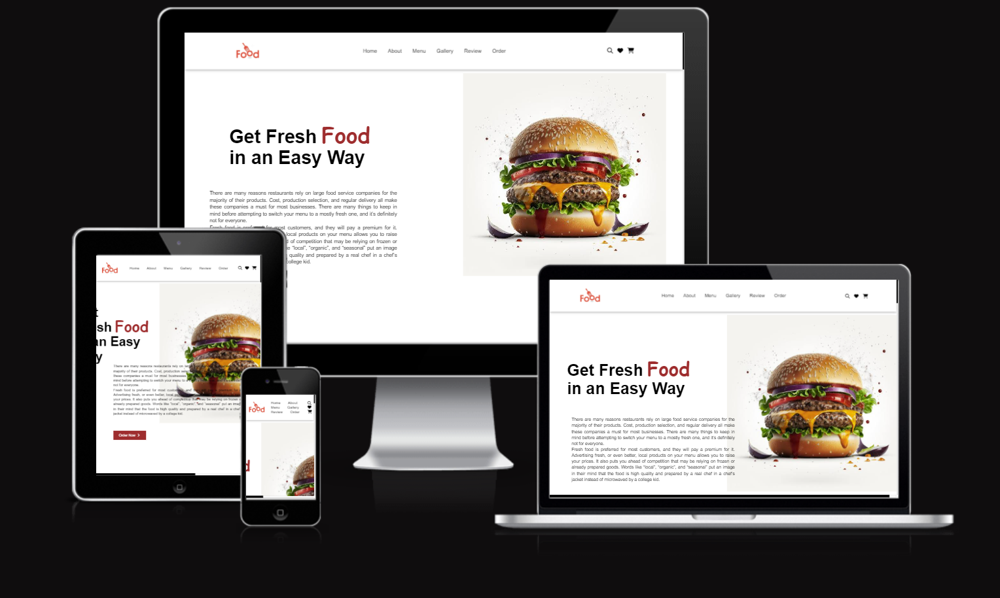

# Pineherst Foods Website README

Visit the deployed site: [Pineherst Foods](https://designergpt.replit.app/)

Welcome to Pineherst Foods! Dive into the world of fresh, delicious cuisine with our comprehensive website designed to cater to all your culinary needs. Whether you're a food enthusiast eager to explore our diverse menu, or a curious visitor looking to learn more about our unique offerings, Pineherst Foods promises an engaging and informative experience for everyone.

 
 
 
 
 
 
 
 

## CONTENTS

- [User Experience (UX)](#user-experience-ux)
  - [Project Goal](#project-goal)
  - [Visitor Goals](#visitor-goals)
  - [Business Goals](#business-goals)
- [Design Choices](#design-choices)
  - [Colour Scheme](#colour-scheme)
  - [Typography](#typography)
  - [Imagery](#imagery)
- [Features](#features)
  - [Navigation](#navigation)
  - [The Home Section](#the-home-section)
  - [The About Section](#the-about-section)
  - [Menu Showcase](#menu-showcase)
  - [Gallery](#gallery)
  - [Customer Reviews](#customer-reviews)
  - [Order Online](#order-online)
  - [The Team](#the-team)
  - [Footer](#footer)
- [Future Implementations](#future-implementations)
- [Technologies Used](#technologies-used)
- [Deployment](#deployment)
- [Credits](#credits)

## User Experience (UX)

### Project Goal

The primary goal of the Pineherst Foods website is to introduce visitors to our brand's unique approach to fresh, high-quality cuisine. We aim to provide an engaging user experience that highlights our diverse menu, our commitment to quality, and the vibrant community that makes Pineherst Foods a destination for food lovers.

### Visitor Goals

Visitors to the Pineherst Foods website are looking for:
- A clear understanding of the restaurant's menu offerings.
- Information about the restaurant's history and values.
- Easy navigation to find information about the menu, locations, and how to order.

### Business Goals

- To attract new customers by showcasing our menu and unique food philosophy.
- To provide an easy way for customers to view the menu and place orders online.
- To enhance our brand's online presence and customer engagement.

## Design Choices

### Colour Scheme

- The primary colours used are a combination of warm earth tones and vibrant greens, reflecting our focus on fresh ingredients and healthy eating.

### Typography

- We've chosen fonts that are easy to read and convey a friendly, welcoming atmosphere.

### Imagery

- High-quality images showcase our food's freshness and quality, and the inviting ambiance of our locations.

## Features

### Navigation

- A simple, intuitive navigation menu that guides visitors through the website smoothly.

### The Home Section

- An introduction to Pineherst Foods with engaging images and a brief welcome message.

### The About Section

- Detailed information about our history, mission, and values.

### Menu Showcase

- A detailed look at our menu, including images and descriptions of our dishes.

### Gallery

- A collection of images showcasing our food, our locations, and the Pineherst Foods experience.

### Customer Reviews

- Testimonials from our customers to build trust with new visitors.

### Order Online

- An easy-to-use online ordering system, allowing customers to place orders directly from the website.

### The Team

- Information about the talented individuals behind Pineherst Foods.

### Footer

- Links to our social media, contact information, and other useful resources.

## Future Implementations

- A blog section to share news, recipes, and food-related content.
- A loyalty program for our regular customers.

## Technologies Used

- HTML, CSS for basic website structure and design.
- JavaScript for interactive elements.

## Deployment

This website is deployed on [Replit](https://designergpt.replit.app/), enabling easy access for visitors to explore Pineherst Foods.

## Credits

All content on this site is original and created for Pineherst Foods.
